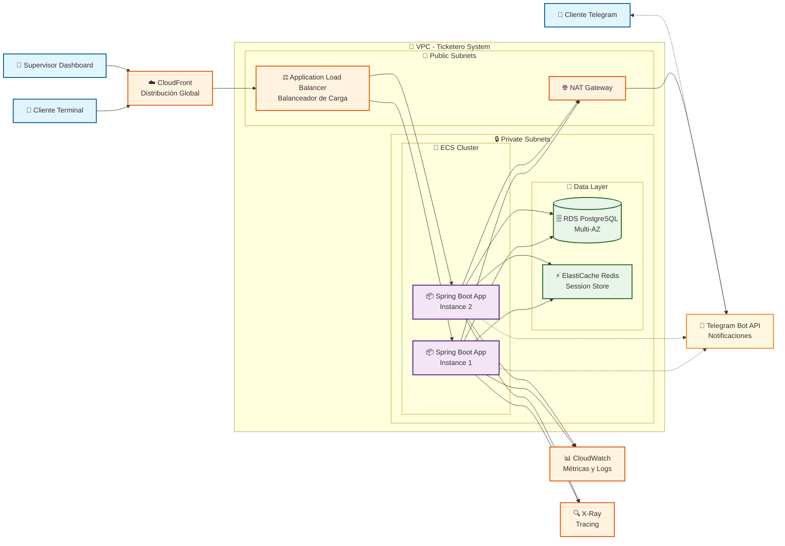

# Diagrama de Arquitectura AWS - Sistema de Gestión de Tickets

## Arquitectura de Despliegue en AWS



## Componentes de la Arquitectura

### **Capa de Presentación**
- **CloudFront**: Distribución global de contenido estático y caché
- **Application Load Balancer**: Balanceador de carga con health checks

### **Capa de Aplicación**
- **ECS Cluster**: Contenedores Docker con Spring Boot 3.2
- **Auto Scaling**: Escalado automático basado en métricas
- **Target Groups**: Distribución de tráfico entre instancias

### **Capa de Datos**
- **RDS PostgreSQL Multi-AZ**: Base de datos principal con alta disponibilidad
- **ElastiCache Redis**: Cache para sesiones WebSocket y datos temporales

### **Servicios de Integración**
- **Telegram Bot API**: Notificaciones push a clientes
- **NAT Gateway**: Conectividad saliente segura

### **Monitoreo y Observabilidad**
- **CloudWatch**: Métricas, logs y alertas
- **X-Ray**: Tracing distribuido para debugging

## Flujos de Datos

### **1. Creación de Ticket**
```
Cliente Terminal → CloudFront → ALB → Spring Boot → PostgreSQL
                                                  → Redis (cache)
                                                  → Telegram API
```

### **2. Dashboard en Tiempo Real**
```
Supervisor → CloudFront → ALB → Spring Boot → WebSocket → Redis
                                            → PostgreSQL (métricas)
```

### **3. Notificaciones Automáticas**
```
Spring Boot → Telegram API → Cliente Móvil
            → CloudWatch (logs)
```

## Consideraciones de Seguridad

### **Network Security**
- VPC con subnets públicas y privadas
- Security Groups restrictivos por capa
- NACLs para control adicional de red

### **Data Security**
- RDS con encriptación en reposo y tránsito
- Secrets Manager para credenciales
- IAM roles con principio de menor privilegio

### **Application Security**
- WAF en CloudFront para protección web
- SSL/TLS end-to-end
- API rate limiting en ALB

## Escalabilidad por Fases

### **Fase Piloto (1 sucursal)**
- 1 instancia ECS (t3.medium)
- RDS db.t3.micro
- Redis cache.t3.micro

### **Fase Expansión (5 sucursales)**
- 2-3 instancias ECS con Auto Scaling
- RDS db.t3.small con Read Replica
- Redis cache.t3.small

### **Fase Nacional (50+ sucursales)**
- Auto Scaling hasta 10 instancias
- RDS db.r5.large con múltiples Read Replicas
- Redis Cluster Mode habilitado
- CloudFront con múltiples origins

## Estimación de Costos Mensual

### **Fase Piloto**
- ECS: ~$50
- RDS: ~$25
- ElastiCache: ~$15
- ALB: ~$20
- **Total: ~$110/mes**

### **Fase Nacional**
- ECS: ~$400
- RDS: ~$200
- ElastiCache: ~$100
- ALB + CloudFront: ~$50
- **Total: ~$750/mes**

---

**Nota**: Este diagrama representa la arquitectura de producción optimizada para alta disponibilidad, escalabilidad y seguridad en AWS.