# Diagrama de Arquitectura AWS - Sistema de Gestión de Tickets

## Arquitectura de Despliegue en AWS

```mermaid
graph LR
    %% Usuarios y Dispositivos
    U1[👤 Cliente Terminal] 
    U2[👤 Supervisor Dashboard]
    U3[📱 Cliente Telegram]
    
    %% Capa de Entrada
    CF[☁️ CloudFront<br/>Distribución Global]
    ALB[⚖️ Application Load Balancer<br/>Balanceador de Carga]
    
    %% VPC y Subnets
    subgraph VPC["🏢 VPC - Ticketero System"]
        subgraph PUB["📡 Public Subnets"]
            ALB
            NAT[🌐 NAT Gateway]
        end
        
        subgraph PRIV["🔒 Private Subnets"]
            subgraph ECS["🐳 ECS Cluster"]
                APP1[📦 Spring Boot App<br/>Instance 1]
                APP2[📦 Spring Boot App<br/>Instance 2]
            end
            
            subgraph DATA["💾 Data Layer"]
                RDS[(🗄️ RDS PostgreSQL<br/>Multi-AZ)]
                REDIS[⚡ ElastiCache Redis<br/>Session Store]
            end
        end
    end
    
    %% Servicios Externos
    TG[📲 Telegram Bot API<br/>Notificaciones]
    
    %% Monitoreo y Logs
    CW[📊 CloudWatch<br/>Métricas y Logs]
    XR[🔍 X-Ray<br/>Tracing]
    
    %% Conexiones - Flujo Principal
    U1 --> CF
    U2 --> CF
    CF --> ALB
    ALB --> APP1
    ALB --> APP2
    
    %% Conexiones - Datos
    APP1 --> RDS
    APP2 --> RDS
    APP1 --> REDIS
    APP2 --> REDIS
    
    %% Conexiones - Notificaciones
    APP1 -.-> TG
    APP2 -.-> TG
    U3 <-.-> TG
    
    %% Conexiones - Monitoreo
    APP1 --> CW
    APP2 --> CW
    APP1 --> XR
    APP2 --> XR
    
    %% Conexiones - Internet
    APP1 --> NAT
    APP2 --> NAT
    NAT --> TG
    
    %% Estilos
    classDef userClass fill:#e1f5fe,stroke:#01579b,stroke-width:2px
    classDef awsService fill:#fff3e0,stroke:#e65100,stroke-width:2px
    classDef appService fill:#f3e5f5,stroke:#4a148c,stroke-width:2px
    classDef dataService fill:#e8f5e8,stroke:#1b5e20,stroke-width:2px
    classDef externalService fill:#fff8e1,stroke:#f57f17,stroke-width:2px
    
    class U1,U2,U3 userClass
    class CF,ALB,NAT,CW,XR awsService
    class APP1,APP2 appService
    class RDS,REDIS dataService
    class TG externalService
```



## Componentes de la Arquitectura

### **Capa de Presentación**
- **CloudFront**: Distribución global de contenido estático y caché
- **Application Load Balancer**: Balanceador de carga con health checks

### **Capa de Aplicación**
- **ECS Cluster**: Contenedores Docker con Spring Boot 3.2
- **Auto Scaling**: Escalado automático basado en métricas
- **Target Groups**: Distribución de tráfico entre instancias

### **Capa de Datos**
- **RDS PostgreSQL Multi-AZ**: Base de datos principal con alta disponibilidad
- **ElastiCache Redis**: Cache para sesiones WebSocket y datos temporales

### **Servicios de Integración**
- **Telegram Bot API**: Notificaciones push a clientes
- **NAT Gateway**: Conectividad saliente segura

### **Monitoreo y Observabilidad**
- **CloudWatch**: Métricas, logs y alertas
- **X-Ray**: Tracing distribuido para debugging

## Flujos de Datos

### **1. Creación de Ticket**
```
Cliente Terminal → CloudFront → ALB → Spring Boot → PostgreSQL
                                                  → Redis (cache)
                                                  → Telegram API
```

### **2. Dashboard en Tiempo Real**
```
Supervisor → CloudFront → ALB → Spring Boot → WebSocket → Redis
                                            → PostgreSQL (métricas)
```

### **3. Notificaciones Automáticas**
```
Spring Boot → Telegram API → Cliente Móvil
            → CloudWatch (logs)
```

## Consideraciones de Seguridad

### **Network Security**
- VPC con subnets públicas y privadas
- Security Groups restrictivos por capa
- NACLs para control adicional de red

### **Data Security**
- RDS con encriptación en reposo y tránsito
- Secrets Manager para credenciales
- IAM roles con principio de menor privilegio

### **Application Security**
- WAF en CloudFront para protección web
- SSL/TLS end-to-end
- API rate limiting en ALB

## Escalabilidad por Fases

### **Fase Piloto (1 sucursal)**
- 1 instancia ECS (t3.medium)
- RDS db.t3.micro
- Redis cache.t3.micro

### **Fase Expansión (5 sucursales)**
- 2-3 instancias ECS con Auto Scaling
- RDS db.t3.small con Read Replica
- Redis cache.t3.small

### **Fase Nacional (50+ sucursales)**
- Auto Scaling hasta 10 instancias
- RDS db.r5.large con múltiples Read Replicas
- Redis Cluster Mode habilitado
- CloudFront con múltiples origins

## Estimación de Costos Mensual

### **Fase Piloto**
- ECS: ~$50
- RDS: ~$25
- ElastiCache: ~$15
- ALB: ~$20
- **Total: ~$110/mes**

### **Fase Nacional**
- ECS: ~$400
- RDS: ~$200
- ElastiCache: ~$100
- ALB + CloudFront: ~$50
- **Total: ~$750/mes**

---

**Nota**: Este diagrama representa la arquitectura de producción optimizada para alta disponibilidad, escalabilidad y seguridad en AWS.